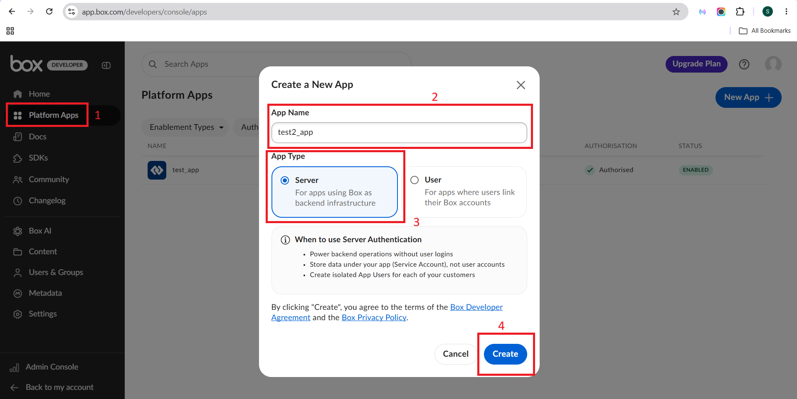
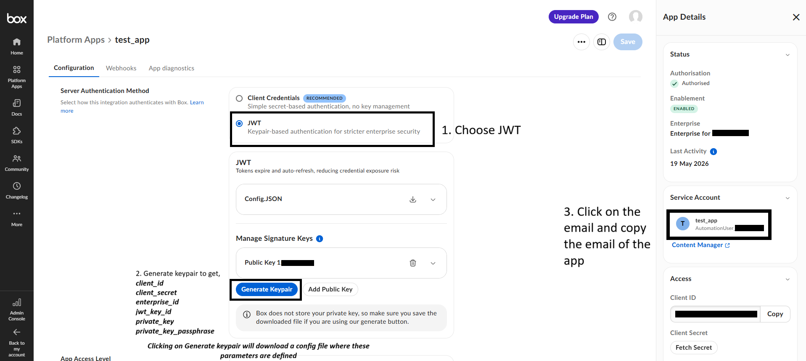
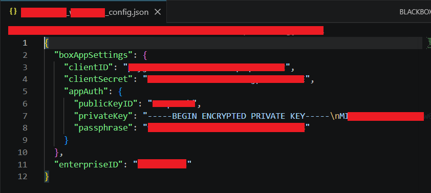
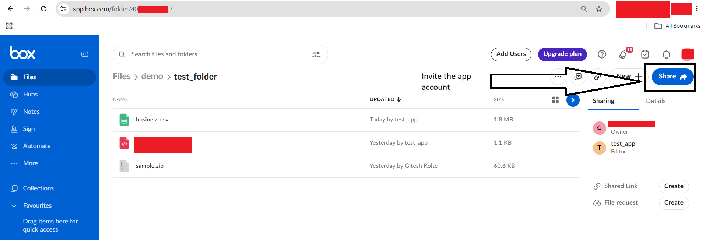
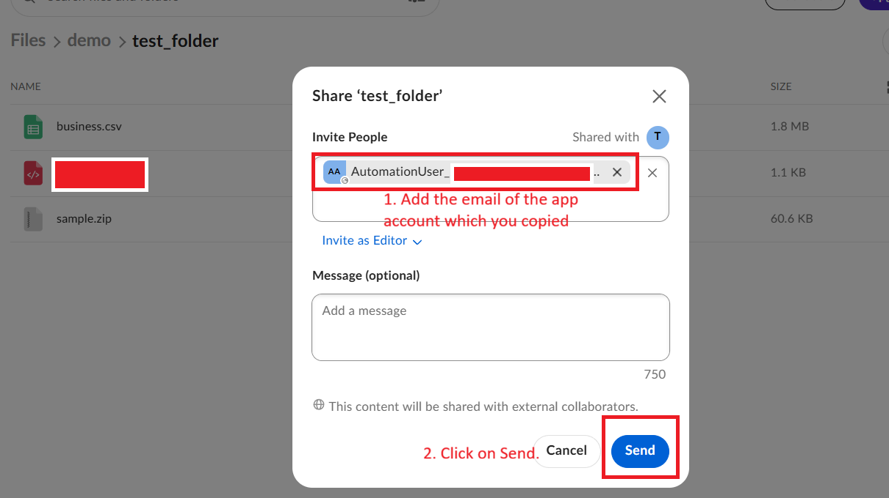
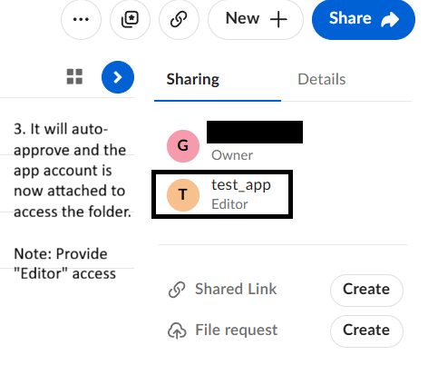

## Setup

1. Create a Box Developer account by visiting:
   https://app.box.com/developers/console

2. Click **New App** and create a **Server Authentication (JWT)** application.

   

3. Configure the application:
   - Select **JWT** as the authentication method.
   - Generate a **Public/Private Keypair** (this downloads the configuration file).
   - Copy the **Service Account (App User) email address** for later use.

   

   

4. Open your Box account:
   https://app.box.com/

   Navigate to the folder you want to access and click **Share**.

   

5. Invite the **Service Account (App User)** using the email copied in Step 3.
   - Grant the user **Editor** permission.
   - Accept the invitation if prompted.

   

   

6. You're all set! You can now use the application to upload and download files from Box.

7. 🎉 Enjoy!